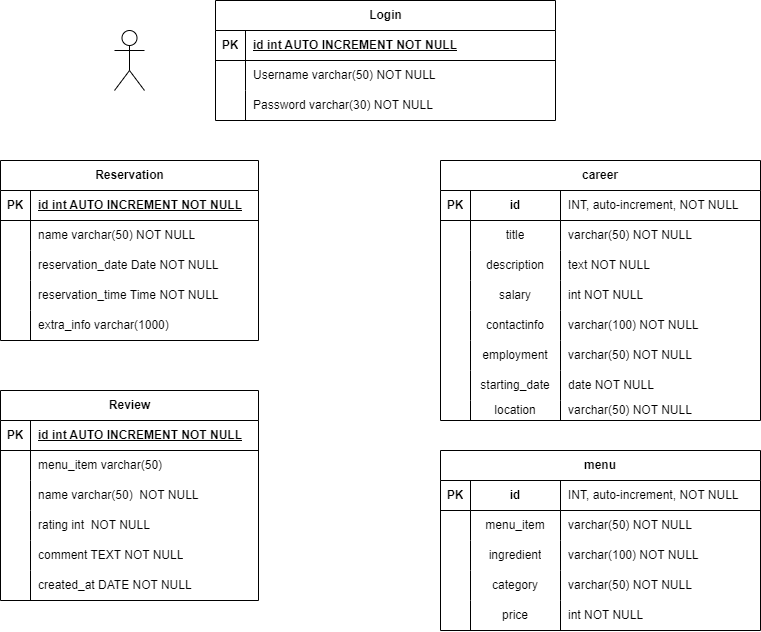

# Exercise 5: Readme.md

***Welcome to the task README!***

- You are required to create ´Readme.md´ in your project directory to document your activities throughout the project's
  lifecycle.
- You will regularly update it to monitor the ongoing development of the project.

- You will start by outlining the planned features, task assignments to team members and document the evolving progress
  of your work.

- Below, you will find an example to help you get started. Feel free to customize it to match your specific requirements
  and needs.

# Project Name - Team Number

A brief description of your web development project.

## Table of Contents

- [Features](#features)
- [Database Tables](#database-tables)
- [Created Forms](#created-forms)
- [Created Tables](#created-tables)

---

## Features

In this section, list and describe the features or functionality that you are working on. You can use checkboxes to
track the progress of each feature.

- [ ] Feature 1 (Richard Svajdlenka): Reservations
- [ ] Feature 2 (Hongqian-li): Review Page
- [ ] Feature 3 (Julian Hack): Gallery picture submission
- [ ] Feature 4 (Attila Vegh): Career/Applications

### Feature 1

Simple system for reservations. A user will be prompted with a form to fill out. The form will contain several fields:

- Name (string input), Required*
- Email (string input with check for whether it is correct), Required*
- Date (Date picker), Required*
- Time (Time picker), Required*
- Special requests (String input)

The reservation will be then sent to the email with additional info. Each reservation in the database will be given a
unique code (not to be confused with id as primary key). This code can then be used to cancel the reservation. Upon
confirmation of the reservation, the reservation will be added to the database in the back-end. This database will be
taken into account when showing possible dates and times for future users.

The admin should be able to also cancel reservations if they want. This will be done by logging into the admin
account on the site. A table of reservations will be shown with buttons to delete given reservation.

**Things to keep in mind:**
 - Reservations can only be added within the restaurant opening times
 - Only one person can have reservation at one time
 - Upon successful reservation, that time should not be selectable
 - Cancellation should bring back the ability to select the time slot

### Feature 2

We have created a new page for the restaurant to conduct marketing campaigns. This page requires customers to provide feedback on the restaurant and select their favorite Italian pizza and pasta.

The form includes the following options:

 - Your Name (Name must be between 3 & 20 characters.) Required*
 - Your Email (Please enter a valid email address.) Required*
 - Select your favorite pizza (Select 1 from a menu of 10 pizzas, presented as a dropdown menu, Required*)
 - Select your favorite pasta (Select 1 from a menu of 10 pastas, presented as a dropdown menu, Required*)
 - Rate Our Restaurant (Select from a dropdown menu with five stars) Required*
 - Comment (Comment must be at least 20 characters long.) Required*

Additionally, this page will calculate the average restaurant rating based on the star ratings provided by customers and data from the database.

**Things to keep in mind:**
 - Feedback with duplicate email addresses can only be submitted once. If an email address that already exists in the database is entered, the webpage will prompt you to use a different email address.
 - The admin interface allows administrators to delete and manage data that is already stored in the database.

### Feature 3

Julian's Feature!!!

### Feature 4

Career page

Now the career page reads from the database. There was an editing page added as well to the admin site, where new career postings can be added or deleted. Before this feature if a new job posting needed to be added it had to be through coding it in to the HTML file. 

---

## Database Tables

List the database tables that are part of your project.

- Table 1 (Richard): Login
- Table 2 (Richard): Reservation
- Table 3 (Hongqian Li): Review
- Table 4 (Attila): Career
- Table 5 (Julian): Menu

---

## Created Forms

List and describe any forms that have been created as part of your project. Include details about the purpose of each
form and any validation logic.

- Form 1 (Richard): Reservations: [GitHub](https://github.com/hongqian-li/web-programming-project/blob/main/reservations.php) | [Shell](http://shell.hamk.fi/~bbcap23_10/Web_programming/reservations.php)
  - Name must be certain length
  - email must be valid
  - Cannot select time that has passed
  - Cannot select negative or zero as number of people
- Form 2: (Created By): Reservation cancel: [GitHub](https://github.com/hongqian-li/web-programming-project/blob/main/reservations.php) | [Shell](http://shell.hamk.fi/~bbcap23_10/Web_programming/reservations.php)
- Form 3: (Hongqian Li): Review: [GitHub](https://github.com/hongqian-li/web-programming-project/blob/main/review.php) | [Shell](http://shell.hamk.fi/~bbcap23_10/Web_programming/review.php)
- Form 4 (Attila) Add career listing: [GitHub](https://github.com/hongqian-li/web-programming-project/blob/main/admin_pages/careerform.php) | [Shell](http://shell.hamk.fi/~bbcap23_10/Web_programming/admin_pages/careerform.php) (Requires login)
- Form 5 (Julian) Add menu item: [GitHub](https://github.com/hongqian-li/web-programming-project/blob/main/admin_pages/menuform.php) | [Shell](http://shell.hamk.fi/~bbcap23_10/Web_programming/admin_pages/menuform.php)

---

## Created Tables

List any tables that you have created in the project work

- Table 1 (Richard): Reservations | [GitHub](https://github.com/hongqian-li/web-programming-project/blob/main/admin_pages/adminReservations.php) | [Shell](http://shell.hamk.fi/~bbcap23_10/Web_programming/admin_pages/adminReservations.php) (Requires Login)
- Table 2 (Attila): Career | [GitHub](https://github.com/hongqian-li/web-programming-project/blob/main/admin_pages/careerread.php) | [Shell](http://shell.hamk.fi/~bbcap23_10/Web_programming/admin_pages/careerread.php) (Requires Login)
- Table 3 (Hongqian Li): Review | [GitHub](https://github.com/hongqian-li/web-programming-project/blob/main/admin_pages/review_read.php) | [Shell](http://shell.hamk.fi/~bbcap23_10/Web_programming/admin_pages/review_read.php) (Requires Login)
- Table 4 (Julian): Menu | [GitHub](https://github.com/hongqian-li/web-programming-project/blob/main/menu.php) | [Shell](http://shell.hamk.fi/~bbcap23_10/Web_programming/menu.php)
