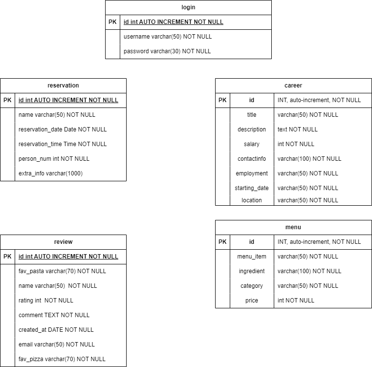

# Exercise 5: Readme.md

***Welcome to the task README!***

- You are required to create ´Readme.md´ in your project directory to document your activities throughout the project's
  lifecycle.
- You will regularly update it to monitor the ongoing development of the project.

- You will start by outlining the planned features, task assignments to team members and document the evolving progress
  of your work.

- Below, you will find an example to help you get started. Feel free to customize it to match your specific requirements
  and needs.

# Project Name - Team Number

A brief description of your web development project.

## Table of Contents

- [Features](#features)
- [Database Tables](#database-tables)
- [Created Forms](#created-forms)
- [Created Tables](#created-tables)

---

## Features

In this section, list and describe the features or functionality that you are working on. You can use checkboxes to
track the progress of each feature.

- [ ] Feature 1 (Richard Svajdlenka): Reservations
- [ ] Feature 2 (Attila Vegh): Career/Applications
- [ ] Feature 3 (Julian Hack): Gallery picture submission
- [ ] Feature 4 (Hongqian-li): Menu adjustment/Opening times adjustment

### Feature 1

Simple system for reservations. A user will be prompted with a form to fill out. The form will contain several fields:

- Name (string input), Required*
- Email (string input with check for whether it is correct), Required*
- Date (Date picker), Required*
- Time (Time picker), Required*
- Special requests (String input)

The reservation will be then sent to the email with additional info. Each reservation in the database will be given a
unique code (not to be confused with id as primary key). This code can then be used to cancel the reservation. Upon
confirmation of the reservation, the reservation will be added to the database in the back-end. This database will be
taken into account when showing possible dates and times for future users.

The admin should be able to also cancel reservations if they want. This will be done by logging into the admin
account on the site. A table of reservations will be shown with buttons to delete given reservation.

**Things to keep in mind:**
 - Reservations can only be added within the restaurant opening times
 - Only one person can have reservation at one time
 - Upon successful reservation, that time should not be selectable
 - Cancellation should bring back the ability to select the time slot

### Feature 2

Hi!

### Feature 3

Julian's Feature!!!

### Feature 4

Create an admin with permissions to modify menus.

---

## Database Tables

List the database tables that are part of your project.

- Table 1 (Richard): Login
- Table 2 (Richard): Reservation
- Table 3 (Hongqian Li): Review
- Table 4 (Attila): Career
- Table 5 (Attila): Menu

---

## Created Forms

List and describe any forms that have been created as part of your project. Include details about the purpose of each
form and any validation logic.

- Form 1 (Created By): Form Name: Link to the related code file (github) | Link to the form (shell.hamk.fi). |
  Validations Applied
- Form 2: (Created By): Form Name: Link to the related code file (github) | Link to the form (shell.hamk.fi). |
  Validations Applied
- Form 3: (Created By): Form Name: Link to the related code file (github) | Link to the form (shell.hamk.fi). |
  Validations Applied

---

## Created Tables

List any tables that you have created in the project work

- Table 1 (Created By): Table Name | Link to the related code file (github) | Link to the table (shell.hamk.fi).
- Table 2 (Created By): Table Name | Link to the related code file (github) | Link to the table (shell.hamk.fi).
- Table 3 (Created By): Table Name | Link to the related code file (github) | Link to the table (shell.hamk.fi).

---

> Feel free to customize this README template to suit your project's specific needs. Providing clear and organized
> documentation will help your team members understand the project's progress and tasks effectively. This document will
> have a significant impact on the grading. 
